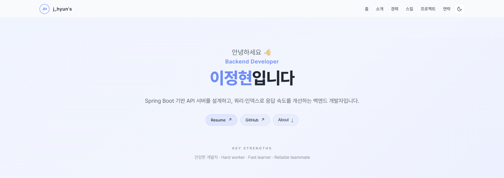
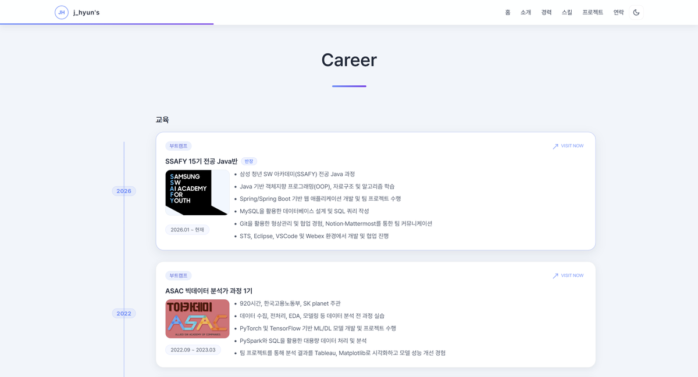
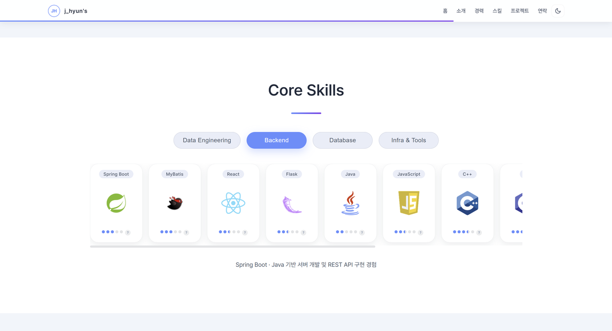
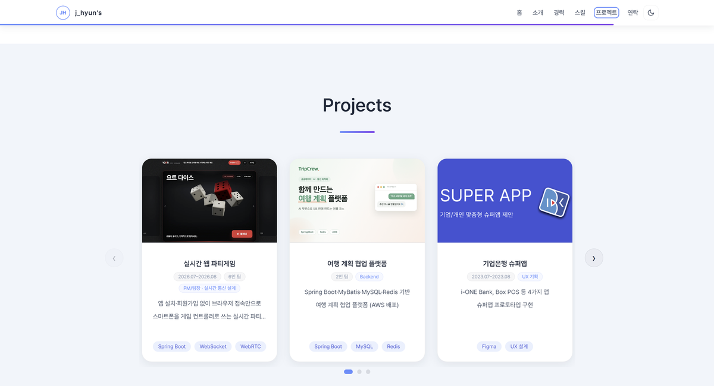

# 이정현 포트폴리오

React + Vite로 구축한 개발자 포트폴리오 웹사이트입니다.

**🌐 배포 페이지:** https://jhyungit.github.io/

<a href="https://jhyungit.github.io/">
  
</a>

<br/>

## 📄 구성

| 섹션 | 내용 |
|------|------|
| 홈 | 한 줄 소개 및 핵심 강점 |
| 소개 | 지향점 · 대표 성과 · 키워드 |
| 경력 | 교육 과정 · 인턴 · 어학 연수 · 자격증 |
| 스킬 | Backend · Database · Data Engineering · Infra 탭 전환 |
| 프로젝트 | 캐러셀 형태의 프로젝트 카드 |
| 연락 | 이메일 · GitHub · 이력서 PDF |

## 🔧 기술 스택


- 다크 모드 토글
- 스크롤 진행률 표시 및 섹션 하이라이트 내비게이션
- 프로젝트 캐러셀 · 스킬 탭 전환
- 반응형 레이아웃

## 🚀 실행 방법

```bash
git clone https://github.com/jhyungit/jhyungit.github.io.git
cd jhyungit.github.io

npm install
npm run dev      # 개발 서버
npm run build    # 프로덕션 빌드
```

## 📸 스크린샷

<details>
<summary><b>섹션별로 펼쳐 보기</b></summary>
<br/>

<table>
  <tr>
    <td width="50%">
      <a href="screenshots/shot-about.png"></a>
      <p align="center"><sub><b>소개</b> · 대표 성과와 키워드</sub></p>
    </td>
    <td width="50%">
      <a href="screenshots/shot-career.png"></a>
      <p align="center"><sub><b>경력</b> · 타임라인 형태의 교육·경력</sub></p>
    </td>
  </tr>
  <tr>
    <td width="50%">
      <a href="screenshots/shot-skills.png"></a>
      <p align="center"><sub><b>스킬</b> · 분야별 탭 전환</sub></p>
    </td>
    <td width="50%">
      <a href="screenshots/shot-projects.png"></a>
      <p align="center"><sub><b>프로젝트</b> · 캐러셀 카드</sub></p>
    </td>
  </tr>
</table>

</details>

## 📫 Contact

**Email** jh021199@gmail.com · **GitHub** [@jhyungit](https://github.com/jhyungit)
