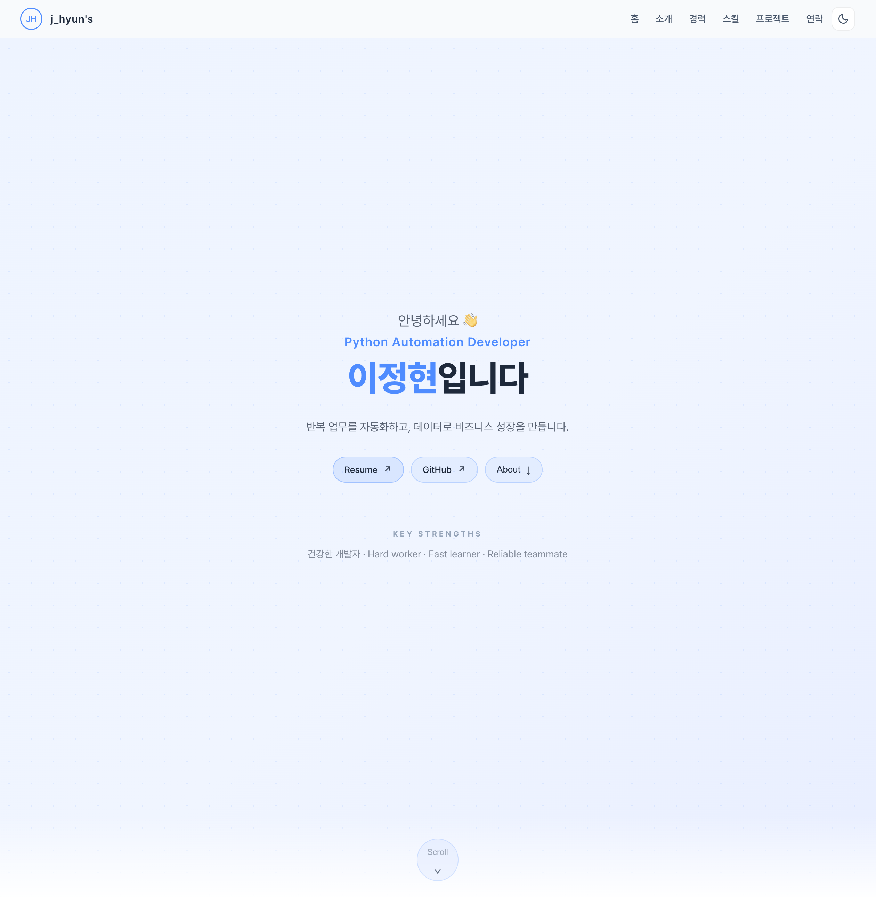

# JH's Portfolio

Python 개발자 채용 심사 흐름에 맞춰 설계 및 고도화한 개인 포트폴리오 웹사이트입니다.

🔗 **배포 페이지:** https://jhyungit.github.io/



---

## Tech Stack

| 분류 | 기술 |
|---|---|
| Frontend | React 19, JavaScript (ES2022) |
| Build | Vite 7 |
| Styling | CSS Custom Properties (Design Tokens), 라이트/다크 모드 |
| Font | Pretendard (Dynamic Subset CDN) |
| Contact | EmailJS |
| Deploy | GitHub Pages |

---

## 구성 섹션

- **Home** — 인트로 및 핵심 강점 요약
- **About** — 자기소개 및 키워드
- **Career** — 경력 타임라인
- **Skill** — 기술 스택 카드
- **Project** — 프로젝트 캐러셀 + 슬라이드 모달
- **Contact** — 이메일 / GitHub / 이력서 PDF

---

## 주요 구현 사항

- CSS 전용 stagger 애니메이션 (framer-motion 미사용)
- `IntersectionObserver` 기반 스크롤 진입 효과 (`useInView` 커스텀 훅)
- 50+ CSS 토큰으로 라이트/다크 모드 단일 소스 관리
- `clamp()` 유체 타이포그래피로 380px~1440px 전 해상도 대응
- 모달 포커스 트랩 + Esc 닫기 + 키보드 접근성 (WCAG AA)
- `prefers-reduced-motion` 전역 대응

---

## 로컬 실행

```bash
npm install
npm run dev
```

빌드 후 미리보기:

```bash
npm run build
npm run preview
```
